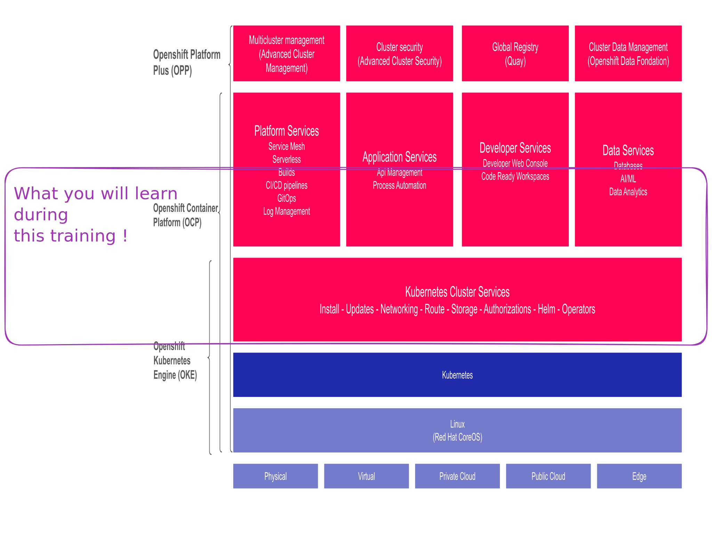

# Objectif du cours

Bienvenue dans ce cours sur OpenShift et Kubernetes. L'objectif de ce cours est de vous fournir une compréhension complète et pratique de l'utilisation de Kubernetes et OpenShift pour déployer, gérer et mettre à l'échelle des applications conteneurisées.

## À qui s'adresse ce cours ?

Ce cours s'adresse à :
* **Les administrateurs système** : qui cherchent à automatiser la gestion des déploiements et des infrastructures.
* **Les développeurs** : qui souhaitent comprendre comment leurs applications s'exécutent dans un environnement conteneurisé et comment ils peuvent tirer parti de Kubernetes et OpenShift pour améliorer leur workflow de développement.
* **Les ingénieurs DevOps** : qui veulent intégrer Kubernetes et OpenShift dans leur chaîne d'outils CI/CD.

## Objectifs d'apprentissage

À la fin de ce cours, vous serez capable de :

1. Comprendre les concepts fondamentaux de Kubernetes et OpenShift.

2. Naviguer et utiliser l'interface de la console OpenShift.

3. Interagir avec OpenShift en utilisant la ligne de commande.

4. Déployer, gérer et mettre à l'échelle des applications conteneurisées.

5. Configurer et gérer le stockage pour les applications.

6. Assurer la fiabilité et la disponibilité des applications déployées.

7. Mettre à jour et maintenir des applications sur OpenShift.

## Structure du cours

Le cours est structuré en modules qui alternent théorie et pratique :

* **Théorie** : Des explications détaillées sur les concepts clés.

* **Pratique** : Des exercices guidés pour appliquer les concepts appris.

* **Quizz** : Des évaluations pour tester vos connaissances et votre compréhension des sujets abordés.

## Pré-requis

Avant de commencer ce cours, il est recommandé d'avoir :

* Une connaissance de base des concepts de virtualisation et de conteneurisation.

* Une expérience avec la ligne de commande Unix/Linux.

* Une compréhension des principes de base des réseaux et du stockage.

## Environnement de travail

Pour suivre les exercices pratiques, vous aurez besoin :

* D'un accès à un cluster OpenShift.

* D'un terminal avec `oc`, le client en ligne de commande OpenShift.

* D'un éditeur de texte pour écrire et modifier des fichiers de configuration.

Nous espérons que ce cours vous sera utile et vous permettra de maîtriser l'utilisation de Kubernetes et OpenShift pour gérer vos applications conteneurisées. Bonne formation !
