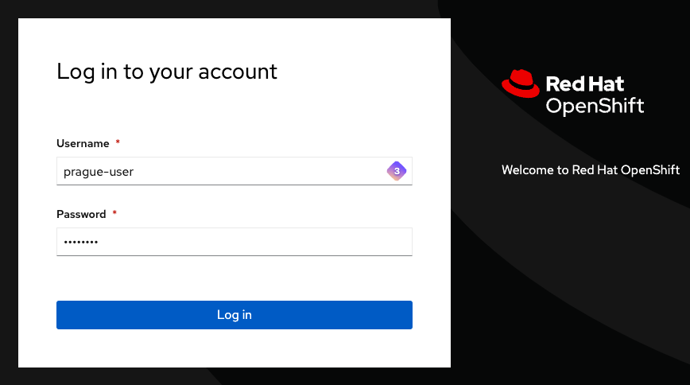

# Organisation de la Formation

Pour faciliter l'apprentissage et les exercices pratiques, un cluster OpenShift a déjà été déployé au préalable. Cette préparation permet de maximiser le temps dédié à l'acquisition de compétences et à la mise en pratique des concepts théoriques.

 Chaque utilisateur dispose sur sa table d'un nom de ville. Cette ville correspond au namespace auquel il aura accès, avec un namespace attribué.

La liste des villes est la suivante:

```shell
Tokyo, Paris, Londres, Rome, Sydney, Rio, Istanbul, Berlin, Nairobi, Madrid, Toronto, Singapour, Stockholm, Athènes, Varsovie, Oslo, Helsinki, Lisbonne, Vienne, Brasilia, Canberra, Ottawa, Séoul, Le Cap, Budapest, Dublin, Zurich, Cardiff, Nicosie, Sofia, Suva, Riga, Vilnius, Alger, Abou Dabi, Bagdad, Bangkok, Le Caire, Freetown, Kaboul, Kinshasa, Libreville, Mexico, Reykjavik, Prague.
```

Chaque utilisateur aura des droits d'administrateur sur son propre namespace, ce qui lui permettra de gérer les ressources et les configurations au sein de cet espace. En plus de cela, les utilisateurs auront la possibilité de créer de nouveaux namespaces sur le cluster selon leurs besoins spécifiques. Des limites de resources ont également été appliqués sur l'ensemble des namespaces.

Si des droits supplémentaires sont requis pour des actions spécifiques ou des configurations plus avancées, ces actions seront effectuées par le formateur, assurant ainsi la sécurité et la bonne gestion des ressources du cluster.

#### Accès au cluster OpenShift

Pour accéder au cluster, les participants utiliseront l'URL suivante :

[https://console-openshift-console.apps.neutron-sno-office.intraneutron.fr/dashboards](https://console-openshift-console.apps.neutron-sno-office.intraneutron.fr/dashboards).

Le nom d'utilisateur sera basé sur le nom de la ville du participant. Par exemple, pour un participant ayant la ville Paris, le nom d'utilisateur sera `paris-user`. Un mot de passe spécifique sera fourni par le formateur pour garantir la sécurité de chaque compte.



L'API du cluster est accessible à l'adresse suivante :

[https://api.neutron-sno-office.intraneutron.fr:6443](https://api.neutron-sno-office.intraneutron.fr:6443).

Cette API permettra aux utilisateurs de réaliser diverses opérations sur le cluster.

#### Déroulement du cours

Le cours est structuré pour alterner entre des chapitres théoriques et des sessions pratiques. Les chapitres théoriques seront présentés par le formateur à l'aide de slides, fournissant ainsi une base solide de connaissances sur OpenShift et ses différentes fonctionnalités. Ces sessions théoriques seront essentielles pour comprendre les concepts clés et les bonnes pratiques à adopter.

Après chaque chapitre théorique, une partie pratique sera organisée. Ces sessions pratiques pourront inclure des quiz à réaliser, permettant ainsi aux participants de tester et de renforcer leurs connaissances de manière collaborative ou des manipulations pratiques qui seront effectuées directement dans les namespaces attribués.

Pour les manipulations pratiques, deux options sont possibles. Les participants pourront utiliser leur propre terminal pour interagir avec le cluster. Alternativement, ils pourront utiliser le terminal Operator, un outil intégré à OpenShift qui facilite la gestion et l'interaction avec les ressources du cluster.

Ces sessions pratiques sont conçues pour offrir une expérience d'apprentissage immersive et interactive, permettant aux participants de mettre en application les concepts théoriques dans des scénarios réels. Le formateur sera présent pour guider les participants, répondre à leurs questions et fournir des clarifications au besoin.

Enfin n'hésitez pas des questions !

{: style="height:80px"}
