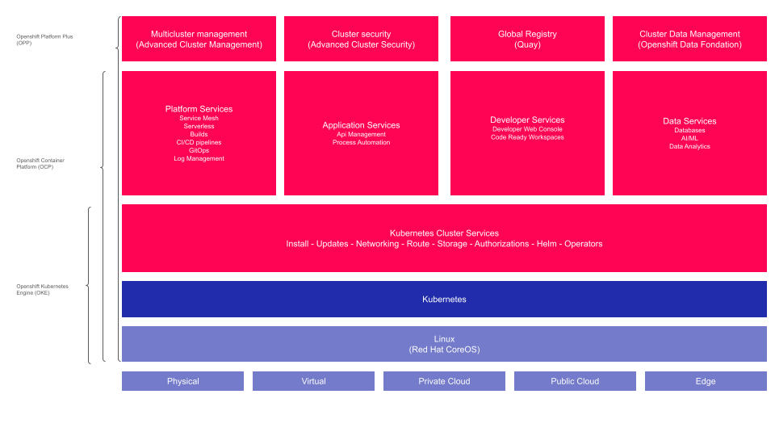

# Présentation d'OpenShift

## Objectif

L'objectif de cette première partie est de fournir une compréhension solide des concepts fondamentaux qui sous-tendent l'utilisation des conteneurs, l'orchestration de ces conteneurs avec Kubernetes, et la façon dont OpenShift s'appuie sur Kubernetes pour offrir une plateforme de conteneurs complète et prête pour les entreprises. Cette partie est divisée en trois sections : une introduction aux conteneurs, une explication de Kubernetes et de l'orchestration de conteneurs, et une présentation d'OpenShift avec ses spécificités par rapport à Kubernetes.

## Comprendre les Conteneurs

### Qu'est-ce qu'un conteneur?

Les conteneurs représentent une révolution dans le développement logiciel et la gestion d'infrastructure. Un conteneur est une unité de déploiement autonome qui encapsule une application avec toutes ses dépendances nécessaires à son exécution. Cela permet à l'application de fonctionner de manière cohérente et fiable quel que soit l'environnement dans lequel elle est déployée.

Un conteneur inclut tout ce dont l'application a besoin : le code, les bibliothèques, les variables d'environnement et les fichiers de configuration. Cette isolation assure que les applications ne partagent pas leurs dépendances avec le système d'exploitation hôte ou d'autres applications, réduisant ainsi les conflits et augmentant la portabilité.

### Avantages des conteneurs

1. **Portabilité accrue**: Les conteneurs fonctionnent de la même manière sur n'importe quel environnement, qu'il s'agisse d'un ordinateur portable, d'un serveur ou d'un cloud, facilitant ainsi le déplacement des applications entre les différents environnements de développement, de test et de production.

2. **Isolation**: Chaque conteneur fonctionne de manière isolée, ce qui signifie qu'une application contenue ne sera pas affectée par les modifications ou les erreurs des autres applications ou du système d'exploitation.

3. **Efficacité des ressources**: Comparés aux machines virtuelles, les conteneurs utilisent les ressources de manière plus efficace car ils partagent le même noyau du système d'exploitation hôte, ce qui permet d'exécuter plusieurs conteneurs sur une seule machine physique ou virtuelle sans le surcoût des hyperviseurs.

4. **Démarrage rapide**: Les conteneurs démarrent presque instantanément, ce qui accélère considérablement les cycles de développement, de test et de déploiement des applications.

5. **Gestion simplifiée des dépendances**: Toutes les dépendances d'une application sont empaquetées dans le conteneur, ce qui élimine les problèmes de version et de compatibilité qui peuvent survenir lorsqu'une application dépend des bibliothèques du système hôte.

Alors que les conteneurs offrent de nombreux avantages pour le développement et le déploiement d'applications, leur gestion à grande échelle nécessite des outils et des processus robustes. C'est là que Kubernetes entre en jeu.

## Introduction à Kubernetes

### Qu'est-ce que Kubernetes?

Kubernetes est une plateforme d'orchestration de conteneurs open source qui simplifie la gestion des applications conteneurisées à grande échelle. Développé à l'origine par Google, Kubernetes est maintenant maintenu par la Cloud Native Computing Foundation (CNCF). Il fournit des mécanismes pour le déploiement, la mise à l'échelle et la gestion automatisés des conteneurs.

### Pourquoi un orchestrateur de conteneurs est-il nécessaire?

1. **Automatisation des déploiements**: Kubernetes automatise le déploiement et la gestion des conteneurs, permettant aux équipes de développement de se concentrer sur l'écriture du code plutôt que sur l'infrastructure.

2. **Équilibrage de charge et mise à l'échelle automatique**: Kubernetes distribue automatiquement le trafic réseau aux conteneurs afin de garantir la stabilité et les performances des applications. Il ajuste également le nombre de conteneurs en fonction de la demande, ce qui permet une utilisation optimale des ressources.

3. **Gestion des pannes**: En cas de défaillance, Kubernetes redémarre automatiquement les conteneurs défaillants, remplace les nœuds, et réalloue les ressources nécessaires pour maintenir les applications en fonctionnement.

4. **Gestion de la configuration et des secrets**: Kubernetes facilite la gestion sécurisée des configurations et des secrets (tels que les mots de passe et les clés API), en les rendant disponibles uniquement aux conteneurs qui en ont besoin.

5. **Orchestration des services**: Kubernetes organise les conteneurs en unités appelées pods, qui peuvent communiquer entre eux et avec d'autres services de manière sécurisée et efficace.

Ainsi, Kubernetes fournit les outils nécessaires pour gérer des conteneurs à grande échelle, ce qui est crucial pour les environnements de production modernes. Pour aller encore plus loin, OpenShift offre une solution basée sur Kubernetes avec des fonctionnalités supplémentaires pour les entreprises.

## Section 3 : Découverte d'OpenShift

### Qu'est-ce qu'OpenShift?

OpenShift est une plateforme de conteneurs d'entreprise développée par Red Hat, qui repose sur Kubernetes. OpenShift ajoute une couche supplémentaire de fonctionnalités et d'outils pour faciliter la gestion, le développement et la sécurisation des applications conteneurisées. Il est conçu pour les environnements de production d'entreprise, offrant des capacités supplémentaires telles qu'une console web intuitive, des outils de développement intégrés, et des services de gestion de la sécurité.

### Différences entre Kubernetes et OpenShift

1. **Interface utilisateur et expérience utilisateur**: OpenShift fournit une console web riche et une interface utilisateur graphique qui simplifient la gestion des conteneurs et des applications. Kubernetes, bien que puissant, nécessite souvent une gestion via des fichiers de configuration et des commandes en ligne de commande, ce qui peut être moins intuitif pour les nouveaux utilisateurs.

2. **Sécurité**: OpenShift intègre des fonctionnalités de sécurité avancées par défaut, comme SELinux (Security-Enhanced Linux) et une gestion des identités et des accès robustes. Cela garantit que les déploiements sont sécurisés dès le départ, sans configurations supplémentaires complexes.

3. **Outils de développement et intégration CI/CD**: OpenShift inclut des outils pour les développeurs tels que des pipelines CI/CD intégrés, des services de gestion des builds et un registre d'images intégré. Ces outils simplifient le développement et le déploiement continu des applications.

4. **Support commercial et stabilité**: En tant que produit Red Hat, OpenShift bénéficie d'un support commercial et est conçu pour offrir une stabilité et une sécurité accrues pour les environnements de production.

5. **Opérateurs Kubernetes**: OpenShift utilise les opérateurs Kubernetes pour automatiser la gestion des applications, facilitant ainsi l'extension des fonctionnalités de la plateforme. Les opérateurs sont des extensions de Kubernetes qui simplifient la gestion des applications complexes.

6. **Options de déploiement flexibles**: OpenShift propose diverses options de déploiement adaptées aux besoins des entreprises, qu'il s'agisse de déploiements sur site, dans des environnements de cloud public ou hybride, ou encore de configurations autogérées ou entièrement gérées par Red Hat.

## Conclusion

En conclusion, OpenShift s'appuie sur Kubernetes pour offrir une solution de conteneurisation plus complète et adaptée aux besoins des entreprises. Il combine la puissance de Kubernetes avec des outils et des fonctionnalités supplémentaires pour simplifier la gestion, renforcer la sécurité et améliorer l'expérience utilisateur, faisant de lui un choix privilégié pour les déploiements en production.
