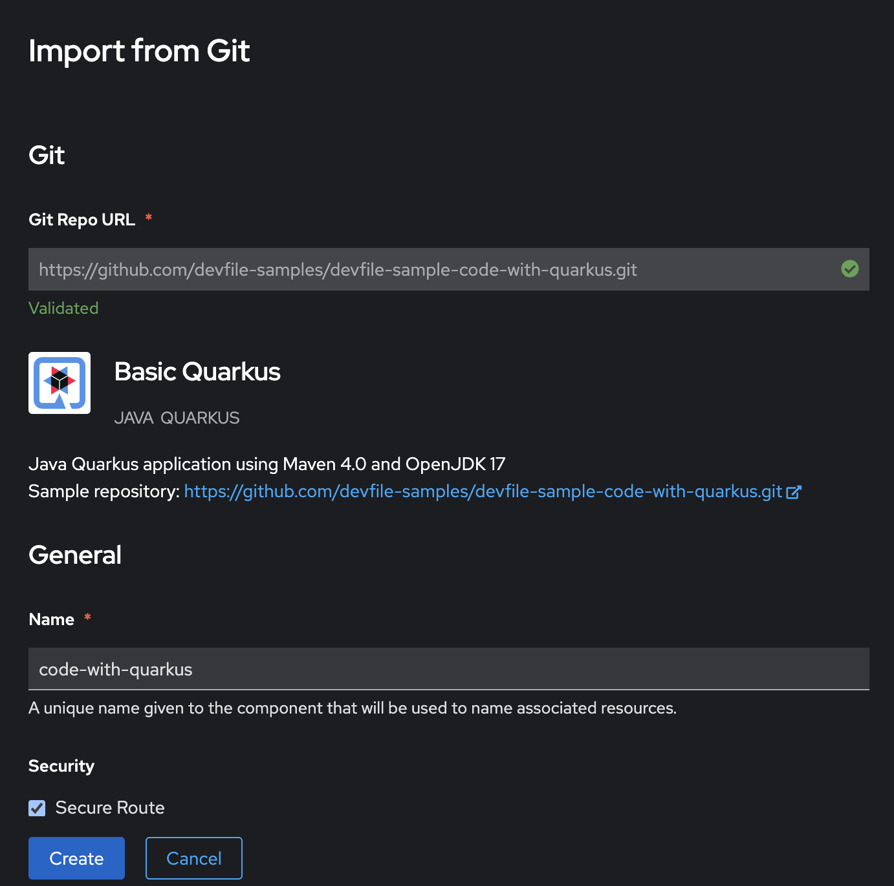
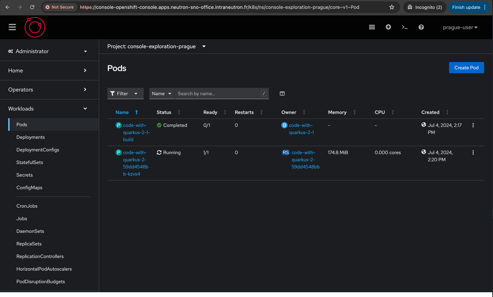

# Exercice Guidé : Exploration de la console OpenShift

Dans cet exercice, vous allez apprendre à naviguer dans la console web d'OpenShift et à effectuer des tâches courantes. Suivez les étapes ci-dessous pour vous familiariser avec l'interface utilisateur et ses fonctionnalités.

## Objectifs de l'exercice

- Accéder à la console web d'OpenShift
- Créer un projet
- Déployer une application à partir d'un template
- Surveiller les ressources du projet
- Configurer et visualiser des alertes

## Étape 1 : Accéder à la console web

1. Ouvrez votre navigateur web.
2. Entrez l'URL de la console web d'OpenShift ci-dessous :
```shell
https://console-openshift-console.apps.neutron-sno-office.intraneutron.fr/
```
3. Cliquez sur `Neutron Guest Identity Management`
4. Connectez-vous avec vos identifiants OpenShift.

## Étape 2 : Créer un projet et déployer une application

Pour utiliser la perspective Developer de la console Web et créer votre premier projet :

1. Dans la vue developer, cliquez sur votre Project en haut à gauche puis sur  "Create a new project" pour ouvrir l'assistant Create Project.

{: style="height:300px"}

Créez un projet nommé "console-exploration-YOURCITY" à l'aide de cet assistant et ajoutez une brève description du projet.

2. Cliquez sur "Create" pour finaliser la création du projet.

{: style="height:300px"}


3. Ensuite, cliquez sur "+Add" pour créer une application.

4. Pour déployer un exemple d'application dans le projet :

   - Cliquez dans "Create applications using samples" sur le lien "Basic Quarkus".

   {: style="height:300px"}

   - Examinez les valeurs par défaut de l'exemple d'application, puis sélectionnez "Create" en bas de la page.

   {: style="height:300px"}


5. Une fois le déploiement effectué, rendez vous dans à la page "Topology" qui affiche maintenant le déploiement de l'application "code-with-quarkus".

6. Pour afficher les détails de ce déploiement :

   - Sélectionnez l'icône correspondant à "code-with-quarkus" dans le panneau "Topology" pour ouvrir les détails du déploiement.

   

   - Dans la partie "Route" cliquez sur la location pour accéder au deploiement de "code-with-quarkus".

   

   

## Étape 4 : Gérer et superviser votre application

Pour basculer vers la perspective Administrator et examiner le déploiement :

1. Depuis la console Web OpenShift cliquez sur "Developer", puis sur "Administrator" pour passer à la perspective Administrator. La console Web se met à jour pour afficher la nouvelle perspective avec des informations supplémentaires via la barre latérale.

2. Accédez à "Home" > "Projects" pour voir la liste des projets disponibles, y compris le projet "console-exploration-YOURCITY" que vous avez créé.


Pour afficher le déploiement et les pods de "code-with-quarkus" :

3. Accédez à "Workloads" > "Pods" dans le menu de la console Web OpenShift pour voir les pods de "code-with-quarkus".



4. Ensuite, allez à "Workloads" > "Deployments" pour voir la liste des déploiements dans le projet. Cliquez sur "code-with-quarkus" pour voir les détails spécifiques du déploiement.


Pour afficher le service et la route de "code-with-quarkus" :

5. Accédez à "Networking" > "Services", puis cliquez sur "code-with-quarkus" pour voir les détails du service.


Pour supprimer le projet et vous déconnecter de la console Web :

6. Retournez à "Home" > "Projects" depuis le menu de la console Web OpenShift.

7. Sélectionnez "Delete Project" dans le menu contextuel du projet "console-exploration-YOURCITY".


8. Saisissez le nom du projet dans la zone de texte pour confirmer la suppression, puis cliquez sur "Delete".


## Conclusion

Vous avez maintenant une bonne compréhension de la console web d'OpenShift. Vous savez comment créer des projets, déployer des applications, surveiller les ressources et configurer des alertes. Continuez à explorer les autres fonctionnalités de la console pour renforcer vos compétences. Si vous avez des questions ou des difficultés, consultez la documentation officielle d'OpenShift ou demandez de l'aide à votre administrateur.

---

Dans la prochaine section, nous aborderons l'architecture d'OpenShift et Kubernetes, en explorant leurs composants clés et leur interaction.
