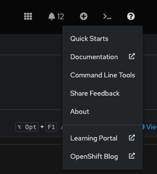

# Interagir avec la Ligne de Commande sur OpenShift

## Objectif de la section

L'objectif de cette section est de fournir une compréhension approfondie de l'interaction avec OpenShift via l'interface de ligne de commande (CLI). Vous apprendrez à installer et configurer les outils nécessaires, ainsi qu'à utiliser des commandes pour gérer et déployer des applications sur OpenShift. Cette section couvrira les concepts fondamentaux pour vous permettre d'exploiter pleinement les capacités de la CLI dans des environnements de développement et de production.

## Introduction aux Interfaces de Ligne de Commande

OpenShift offre deux interfaces de ligne de commande principales pour la gestion des clusters et des applications : `kubectl` et `oc`. Ces outils sont cruciaux pour les développeurs et les administrateurs qui préfèrent ou ont besoin d'interagir directement avec leurs clusters OpenShift depuis un terminal, plutôt que par la console Web.

### Kubectl et OC : Différences et Complémentarités

`kubectl` est l'outil de ligne de commande natif de Kubernetes. Il offre une interface pour interagir avec les clusters Kubernetes en exécutant des commandes qui communiquent avec l'API Kubernetes. `kubectl` est essentiel pour toute gestion de base de Kubernetes, permettant la création, la mise à jour, la suppression et l'inspection des ressources Kubernetes telles que les pods, les services, et les déploiements.

`oc`, quant à lui, est une extension de `kubectl` fournie par OpenShift. En plus des commandes de base de Kubernetes, `oc` inclut des fonctionnalités spécifiques à OpenShift qui ne sont pas disponibles dans `kubectl`. Par exemple, `oc` ajoute des commandes pour gérer les projets, les routes, les configurations de déploiement, et bien plus encore. En utilisant `oc`, les utilisateurs peuvent accéder à des capacités avancées d'OpenShift tout en conservant l'accès aux commandes standard de Kubernetes.

## Installation des Outils de Ligne de Commande

Pour interagir avec OpenShift via la ligne de commande, il est nécessaire d'installer les outils `kubectl` et `oc`. L'installation de `oc` inclut généralement `kubectl`, rendant ainsi l'ensemble du processus plus simple pour les utilisateurs d'OpenShift.

### Installation de OC

Pour installer `oc`, suivez ces étapes :

1. **Téléchargez le client OpenShift** :
    - Accédez à la console Web OpenShift.
    - Cliquez sur le point d'interrogation en haut à droite et sélectionnez "Command Line Tools".
    {: style="height:100px"}
    - Téléchargez l'archive du client OpenShift pour votre système d'exploitation.
    

2. **Décompressez l'archive** :
    - Sous Linux ou macOS :
      ```bash
      tar xvzf openshift-client-linux.tar.gz
      ```
    - Sous Windows, utilisez un outil de décompression comme 7-Zip pour extraire les fichiers.

3. **Ajoutez `oc` à votre PATH** :
    - Sous Linux ou macOS :
      ```bash
      sudo mv oc /usr/local/bin/
      ```

## Authentification et Connexion

Pour interagir avec un cluster OpenShift, il est essentiel de s'authentifier correctement. L'authentification assure que seules les personnes autorisées peuvent accéder et manipuler les ressources du cluster.

### Connexion avec OC

La commande `oc login` est utilisée pour authentifier vos requêtes auprès du cluster OpenShift. Cette commande utilise un token OAuth pour vérifier votre identité.

```bash
oc login https://api.ocp4.example.com:6443
Username: developer
Password: developer
```

#### Explication et Exemple d'Output

- **Commande** :
  ```bash
  oc login https://api.ocp4.example.com:6443
  ```
  - **Action** : Se connecte au cluster OpenShift en utilisant l'URL du serveur API.
  - **Input** : Vous serez invité à entrer votre nom d'utilisateur et votre mot de passe.

- **Exemple d'Output** :
  ```
  Login successful.

  You have access to 58 projects, the list has been suppressed. You can list all projects with 'oc projects'

  Using project "default".
  ```

Ce message confirme une connexion réussie et vous informe que vous êtes actuellement dans le projet "default".

## Gestion des Projets

Les projets dans OpenShift sont des espaces de noms Kubernetes avec des annotations supplémentaires. Ils permettent d'isoler les ressources de votre application et de gérer des environnements distincts.

### Création d'un Projet

Pour créer un nouveau projet, utilisez la commande `oc new-project` :

```bash
oc new-project myapp
```

#### Explication et Exemple d'Output

- **Commande** :
  ```bash
  oc new-project myapp
  ```
  - **Action** : Crée un nouveau projet nommé "myapp".
  - **Input** : Le nom du projet que vous souhaitez créer.

- **Exemple d'Output** :
  ```
  Now using project "myapp" on server "https://api.ocp4.example.com:6443".

  You can add applications to this project with the 'new-app' command. For example, try:

      oc new-app django-psql-example

  to build a new example application in Python. Or use kubectl to deploy a simple Kubernetes app:

      kubectl create deployment hello-node --image=k8s.gcr.io/serve_hostname
  ```

Ce message indique que le projet "myapp" a été créé avec succès et vous donne des suggestions pour ajouter des applications à ce projet.

## Commandes Essentielles pour la Gestion des Ressources

Les commandes `oc` et `kubectl` offrent un ensemble riche de fonctionnalités pour la gestion des ressources dans OpenShift. Voici quelques-unes des commandes les plus utilisées :

### Afficher les Ressources

- **Lister les pods** :
  ```bash
  oc get pods
  ```

#### Explication et Exemple d'Output

- **Commande** :
  ```bash
  oc get pods
  ```
  - **Action** : Affiche la liste des pods dans le projet actuel.

- **Exemple d'Output** :
  ```
  NAME                       READY   STATUS    RESTARTS   AGE
  myapp-1-abcde              1/1     Running   0          5m
  myapp-2-abcde              1/1     Running   0          3m
  ```

Ce tableau montre les noms des pods, leur état de préparation, leur statut, le nombre de redémarrages, et leur âge.

- **Afficher les détails d'un pod spécifique** :
  ```bash
  oc describe pod <nom_du_pod>
  ```

#### Explication et Exemple d'Output

- **Commande** :
  ```bash
  oc describe pod myapp-1-abcde
  ```
  - **Action** : Affiche des détails complets sur le pod nommé "myapp-1-abcde".

- **Exemple d'Output** :
  ```
  Name:           myapp-1-abcde
  Namespace:      myapp
  Node:           worker-1/192.168.1.101
  Start Time:     Fri, 15 Jul 2023 10:15:00 +0000
  Labels:         app=myapp
  Status:         Running
  IP:             10.129.2.1
  Containers:
    myapp:
      Container ID:   docker://abcdef12345
      Image:          myapp:latest
      Image ID:       docker-pullable://myapp@sha256:123456789abcdef
      Port:           8080/TCP
      State:          Running
      Ready:          True
  ```

Cette sortie fournit des informations détaillées sur le pod, y compris ses conteneurs, l'ID de l'image, l'adresse IP, et l'état actuel.

### Créer et Supprimer des Ressources

- **Créer une ressource à partir d'un fichier YAML** :
  ```bash
  oc create -f pod.yaml
  ```

#### Explication et Exemple d'Output

- **Commande** :
  ```bash
  oc create -f pod.yaml
  ```
  - **Action** : Crée des ressources dans le cluster OpenShift en utilisant les définitions spécifiées dans le fichier YAML "pod.yaml".

- **Exemple d'Output** :
  ```
  pod/myapp-3-abcde created
  ```

Ce message confirme que le pod spécifié dans le fichier "pod.yaml" a été créé avec succès.

- **Supprimer une ressource** :
  ```bash
  oc delete pod <nom_du_pod>
  ```

#### Explication et Exemple d'Output

- **Commande** :
  ```bash
  oc delete pod myapp-1-abcde
  ```
  - **Action** : Supprime le pod nommé "myapp-1-abcde".

- **Exemple d'Output** :
  ```
  pod "myapp-1-abcde" deleted
  ```

Ce message confirme que le pod "myapp-1-abcde" a été supprimé avec succès.

### Vérifier l'État du Cluster

- **Obtenir des informations sur le cluster** :
  ```bash
  oc cluster-info
  ```

#### Explication et Exemple d'Output

- **Commande** :
  ```bash
  oc cluster-info
  ```
  - **Action** : Affiche les informations de base sur le cluster OpenShift.

- **Exemple d'Output** :
  ```
  Kubernetes master is running at https://api.ocp4.example.com:6443
    KubeDNS is running at https://api.ocp4.example.com:6443/api/v1/namespaces/kube-system/services/kube-dns:dns/proxy
    ```

  Cette sortie montre l'URL du serveur API principal de Kubernetes ainsi que l'adresse du service DNS du cluster.

  ### Déploiement d'Applications

  OpenShift facilite le déploiement d'applications à travers une série de commandes simples. Voici quelques commandes clés pour déployer des applications.

  #### Création d'une Nouvelle Application

  - **Créer une nouvelle application** :
    ```bash
    oc new-app <image>
    ```

  #### Explication et Exemple d'Output

  - **Commande** :
    ```bash
    oc new-app nginx
    ```
    - **Action** : Crée une nouvelle application en utilisant l'image Docker "nginx".

  - **Exemple d'Output** :
    ```
    --> Found image 64b0af3 (9 days old) in image stream "openshift/nginx" under tag "latest" for "nginx"

        * An image stream tag will be created as "nginx:latest" that will track this image
        * This image will be deployed in deployment config "nginx"
        * Port 8080/tcp will be load balanced by service "nginx"
          * Other containers can access this service through the hostname "nginx"

    --> Creating resources ...
        imagestream.image.openshift.io "nginx" created
        deploymentconfig.apps.openshift.io "nginx" created
        service "nginx" created
    --> Success
    ```

  Ce message indique que l'application basée sur l'image "nginx" a été créée avec succès, avec les ressources associées comme le flux d'image, la configuration de déploiement, et le service.

  #### Exposition d'un Service

  Pour rendre votre application accessible de l'extérieur du cluster, vous pouvez exposer un service en créant une route.

  - **Exposer un service** :
    ```bash
    oc expose svc/<nom_du_service>
    ```

  #### Explication et Exemple d'Output

  - **Commande** :
    ```bash
    oc expose svc/nginx
    ```
    - **Action** : Expose le service "nginx" pour le rendre accessible à l'extérieur du cluster.

  - **Exemple d'Output** :
    ```
    route.route.openshift.io/nginx exposed
    ```

  Ce message confirme que le service "nginx" a été exposé avec succès, ce qui signifie qu'une route a été créée pour permettre l'accès externe à l'application.

  ### Mise à Jour des Applications

  Les applications nécessitent souvent des mises à jour pour déployer de nouvelles versions ou appliquer des correctifs.

  #### Mise à Jour d'une Image de Déploiement

  - **Mettre à jour une image de déploiement** :
    ```bash
    oc set image dc/<nom_du_deploymentconfig> <nom_du_container>=<nouvelle_image>
    ```

  #### Explication et Exemple d'Output

  - **Commande** :
    ```bash
    oc set image dc/nginx nginx=nginx:latest
    ```
    - **Action** : Met à jour l'image du conteneur "nginx" dans la configuration de déploiement "nginx" avec la nouvelle image "nginx:latest".

  - **Exemple d'Output** :
    ```
    deploymentconfig.apps.openshift.io/nginx image updated
    ```

  Ce message indique que l'image du conteneur dans la configuration de déploiement "nginx" a été mise à jour avec succès.

  ### Surveillance des Applications

  Une fois vos applications déployées, il est important de surveiller leur état pour s'assurer qu'elles fonctionnent correctement.

  #### Afficher les Logs d'un Pod

  - **Afficher les logs** :
    ```bash
    oc logs <nom_du_pod>
    ```

  #### Explication et Exemple d'Output

  - **Commande** :
    ```bash
    oc logs myapp-1-abcde
    ```
    - **Action** : Affiche les logs du pod nommé "myapp-1-abcde".

  - **Exemple d'Output** :
    ```
    [INFO] Starting nginx...
    [INFO] nginx is running.
    ```

  Ces logs fournissent des informations sur l'état du pod et les opérations effectuées par le conteneur.

  ### Exécution de Commandes dans un Pod

  Pour diagnostiquer des problèmes ou administrer des applications, il peut être nécessaire d'exécuter des commandes directement dans un pod.

  - **Exécuter une commande dans un pod** :
    ```bash
    oc exec <nom_du_pod> -- <commande>
    ```

  #### Explication et Exemple d'Output

  - **Commande** :
    ```bash
    oc exec myapp-1-abcde -- ls /app
    ```
    - **Action** : Exécute la commande `ls /app` dans le pod "myapp-1-abcde".

  - **Exemple d'Output** :
    ```
    index.html
    main.js
    style.css
    ```

  Cette sortie montre les fichiers dans le répertoire `/app` du pod, aidant ainsi à vérifier que les fichiers nécessaires sont présents.

  ## Conclusion

  L'utilisation de la ligne de commande avec OpenShift, via `kubectl` et `oc`, offre une puissance et une flexibilité considérables pour gérer des clusters et des applications. En comprenant les commandes essentielles et en apprenant à interpréter leurs sorties, vous serez bien équipé pour administrer efficacement vos environnements OpenShift, déployer des applications, gérer des ressources et diagnostiquer des problèmes. La maîtrise de ces outils est essentielle pour tout professionnel travaillant dans un environnement Kubernetes/OpenShift, offrant ainsi un contrôle granulaire et des capacités avancées pour une gestion optimale des infrastructures cloud-native.
