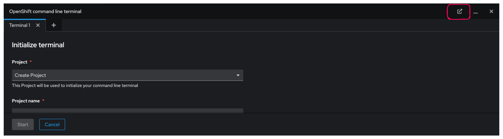
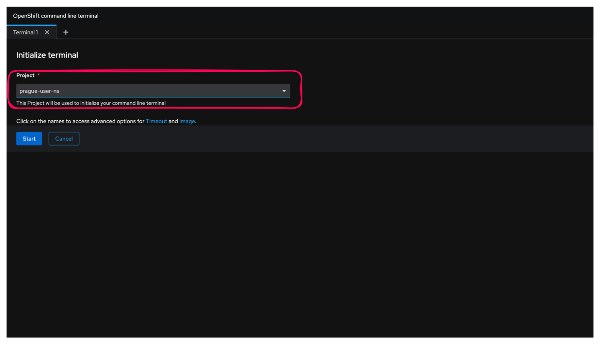

# Exercice Guidé : Interaction avec OpenShift via la Ligne de Commande

### Objectif

Cet exercice vous guidera à travers les étapes de base pour se connecter à un cluster OpenShift, explorer les commandes disponibles, et gérer une application simple.

Toutes les commandes doivent être exécutées dans le **terminal web d'OpenShift**.

---

**1. Connexion au Cluster OpenShift**

Pour commencer, vous devez vous connecter à votre cluster OpenShift :

1. **Accédez à la console Web OpenShift**.
2. **Cliquez sur votre nom d'utilisateur en haut à droite**.
3. **Sélectionnez "Copy login command"**.

    

4. **Cliquez sur "Display Token"** pour afficher le token.

    

5. **Copiez la commande de connexion affichée**.
6. **Ouvrez le terminal web OpenShift en haut à droite**.

7. **Cliquez sur Open terminal in a new tab et selectionnez votre projet. Cliquez sur start. Le premier démarrage peut prendre quelques secondes**
----

----


6. **Collez et exécutez cette commande dans votre terminal web OpenShift**.

```bash
oc login --token=<votre_token> --server=https://api.ocp4.example.com:6443
```

Vous devriez voir un message confirmant la connexion réussie :
```
Login successful.

You have access to 58 projects, the list has been suppressed. You can list all projects with 'oc projects'

Using project "default".
```

Cette étape vous connecte à votre cluster OpenShift en utilisant un token d'authentification. La connexion est nécessaire pour interagir avec les ressources de votre cluster via la ligne de commande.

---

**2. Exploration des Commandes Disponibles**

Maintenant que vous êtes connecté, voyons les commandes que vous pouvez utiliser pour interagir avec votre cluster :

1. **Listez les commandes disponibles avec `kubectl`** :
```bash
kubectl help
```
Vous verrez une liste de commandes disponibles pour interagir avec Kubernetes, par exemple :
```
Basic Commands (Beginner):
  create        Create a resource from a file or from stdin.
  expose        Take a replication controller, service, deployment or pod and expose it as a new Kubernetes Service
  run           Run a particular image on the cluster
  set           Set specific features on objects
```

2. **Listez les commandes disponibles avec `oc`** :
```bash
oc help
```
Vous verrez une liste de commandes disponibles pour interagir avec OpenShift, y compris les commandes spécifiques à OpenShift, par exemple :
```
Build and Deploy Commands:
  new-app      Create a new application
  new-build    Create a new build configuration
  start-build  Start a new build
```

La commande `oc` prend en charge les mêmes fonctionnalités que la commande `kubectl`. La commande `oc` fournit des commandes supplémentaires pour la prise en charge native d’un cluster OpenShift. La commande `new-project`, par exemple, crée dans le cluster OpenShift un projet qui est un espace de noms Kubernetes. La commande `new-app` est spécifique à la commande `oc`. Elle crée des applications en utilisant le code source existant ou des images prédéfinies.

---

**3. Gestion des Namespaces**

Les namespaces permettent d'organiser les ressources dans votre cluster. Vous pouvez voir le namespace actuel et en changer si nécessaire :

1. **Affichez le namespace actuel** :
```bash
oc project
```
Vous verrez une sortie similaire à celle-ci :
```
Using project "prague-user-ns" from context named "prague-user-context" on server "https://172.30.0.1:443".
```

2. **Changez de namespace (si nécessaire)** :
```bash
oc project <nom_du_namespace>
```
Par exemple :
```bash
oc project myproject
```
Vous verrez une confirmation du changement de projet :
```
Now using project "myproject" on server "https://api.ocp4.example.com:6443".
```

Les namespaces (ou projets) permettent d'isoler les ressources dans un cluster. Cette commande vous permet de vérifier et de changer le namespace actif pour organiser et accéder aux ressources spécifiques à un projet.

---

**4. Création d'une Nouvelle Application**

Nous allons maintenant créer une application simple en utilisant une image de base. Suivez ces étapes :

1. **Créez une nouvelle application en utilisant une image de base** :
```bash
oc new-app --image=quay.io/neutron-it/p02l01-go-app
```
Vous verrez une sortie similaire à celle-ci :
```
--> Found container image ec997ee (10 minutes old) from quay.io for "quay.io/neutron-it/p02l01-go-app"

    Go 1.21.11
    ----------
    Go Toolset available as a container is a base platform for building and running various Go applications and frameworks. Go is an easy to learn, powerful, statically typed language in the C/C++ tradition with garbage collection, concurrent programming support, and memory safety features.

    Tags: builder, golang, golang121, rh-golang121, go

    * An image stream tag will be created as "p02l01-go-app:latest" that will track this image

--> Creating resources ...
    deployment.apps "p02l01-go-app" created
    service "p02l01-go-app" created
--> Success
    Application is not exposed. You can expose services to the outside world by executing one or more of the commands below:
     'oc expose service/p02l01-go-app'
    Run 'oc status' to view your app.
```

Cette commande crée une nouvelle application basée sur l'image "p02l01-go-app". OpenShift crée automatiquement les ressources nécessaires, comme l'image stream, la configuration de déploiement et le service.

---

**5. Description de l'Application**

Pour obtenir des détails sur l'application que vous venez de créer :

1. **Décrivez votre application pour obtenir des détails** :
```bash
oc describe deployment/p02l01-go-app
```
Vous verrez une sortie détaillée avec des informations sur la configuration de déploiement, les stratégies de déploiement, l'état des réplicas, et plus encore :
```
Name:                   p02l01-go-app
Namespace:              prague-user-ns
CreationTimestamp:      Sun, 21 Jul 2024 10:09:10 +0000
Selector:               deployment=p02l01-go-app
Replicas:               1 desired | 1 updated | 1 total | 1 available | 0 unavailable
StrategyType:           RollingUpdate
MinReadySeconds:        0
RollingUpdateStrategy:  25% max unavailable, 25% max surge
...
```

Cette commande fournit des informations détaillées sur la configuration de déploiement de votre application, y compris l'état actuel des pods, les stratégies de déploiement et les sélecteurs.

---

**6. Affichage des Logs de l'Application**

Pour diagnostiquer les problèmes ou vérifier que tout fonctionne correctement :

1. **Affichez les logs de l'application** :
```bash
oc logs dc/nginx
```
Vous verrez les logs générés par les conteneurs de votre application :
```
[INFO] Starting nginx...
[INFO] nginx is running.
```

Les logs sont essentiels pour diagnostiquer les problèmes et vérifier que l'application fonctionne comme prévu.

---

Pour compléter votre exercice guidé avec les commandes `oc exec`, `oc get services`, et `oc get co`, voici comment les intégrer dans le tutoriel :

---

**7. Exécution de Commandes dans un Pod**

Pour interagir avec les conteneurs de votre application, vous pouvez exécuter des commandes directement dans un pod en utilisant `oc exec` :

1. **Obtenez la liste des pods** :
   ```bash
   oc get pods
   ```
   Vous verrez une liste des pods en cours d'exécution, par exemple :
   ```
   NAME                           READY   STATUS    RESTARTS   AGE
   p02l01-go-app-7f5b7fdfd6-4rfsl   1/1     Running   0          2m
   ```

2. **Exécutez une commande dans un pod** :
   Pour obtenir un shell interactif dans un pod :
   ```bash
   oc exec -it <pod-name> -- /bin/sh
   ```
   Remplacez `<pod-name>` par le nom du pod obtenu à l'étape précédente. Cela vous permettra de vous connecter au pod et d'exécuter des commandes à l'intérieur.

   Pour afficher les fichiers dans le répertoire `/usr/local/bin` du pod :
   ```bash
   oc exec -it <pod-name> -- ls /usr/local/bin
   ```

---

**8. Vérification des Services**

Pour voir les services disponibles dans votre projet :

1. **Affichez la liste des services** :
   ```bash
   oc get services
   ```
   Vous verrez une liste des services disponibles, par exemple :
   ```
   NAME            TYPE        CLUSTER-IP     EXTERNAL-IP   PORT(S)          AGE
   p02l01-go-app   ClusterIP   172.30.140.1   <none>        8080/TCP         3m
   ```

   Cette commande affiche les services disponibles, leur type, et les ports qu'ils exposent.

---

**9. Vérification des Composants du Cluster**

Pour obtenir des informations sur les composants du cluster OpenShift, comme les nœuds, les pods et les autres ressources clés :

1. **Affichez les composants du cluster** :
   ```bash
   oc get co
   ```
   Vous verrez la liste des composants du cluster avec leur statut, par exemple :
   ```
   NAME                             VERSION   AVAILABLE   PROGRESSING   DEGRADED   SINCE
   authentication                    4.12.0    True        False         False      1d
   cloud-credential                  4.12.0    True        False         False      1d
   config-operator                   4.12.0    True        False         False      1d
   ...
   ```

   Cette commande fournit une vue d'ensemble des composants critiques du cluster OpenShift, y compris leur version et leur état actuel.

**10. Suppression de l'Application**

Enfin, pour nettoyer les ressources créées :

1. **Supprimez l'application nouvellement créée** :
```bash
oc delete all -l app=nginx
```
Vous verrez une confirmation de suppression :
```
pod "nginx-1-deploy" deleted
pod "nginx-1-rw9k8" deleted
service "nginx" deleted
deploymentconfig.apps.openshift.io "nginx" deleted
```

Cette commande supprime toutes les ressources associées à l'application "nginx" en utilisant une étiquette (label). C'est une méthode rapide pour nettoyer les ressources créées.

---

### Conclusion

En suivant ces étapes, vous aurez appris à vous connecter à un cluster OpenShift, à comparer les commandes `kubectl` et `oc`, à obtenir des informations sur le cluster, à gérer des namespaces, à créer et gérer une application, et enfin à supprimer cette application. Ces compétences sont essentielles pour administrer efficacement des environnements OpenShift et Kubernetes.
