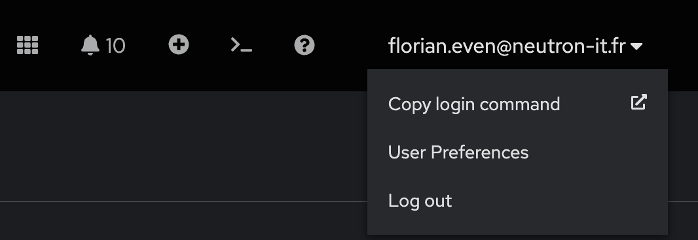
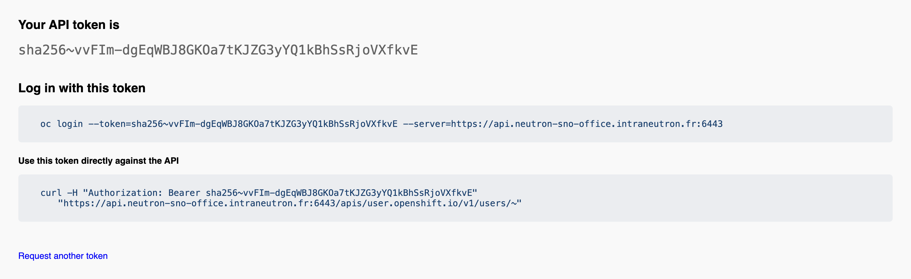

## Exercice Guidé : Interaction avec OpenShift via la Ligne de Commande

### Objectif

Cet exercice vous guidera à travers les étapes de base pour se connecter à un cluster OpenShift, explorer les commandes disponibles, et gérer une application simple.

Toutes les commandes doivent être exécutées dans le **terminal web d'OpenShift**.

---

**1. Connexion au Cluster OpenShift**

Pour commencer, vous devez vous connecter à votre cluster OpenShift :

1. **Accédez à la console Web OpenShift**.
2. **Cliquez sur votre nom d'utilisateur en haut à droite**.
3. **Sélectionnez "Copy login command"**.

    

4. **Cliquez sur "Display Token"** pour afficher le token.

    

5. **Copiez la commande de connexion affichée**.
6. **Collez et exécutez cette commande dans votre terminal web OpenShift**.

    ```bash
    oc login --token=<votre_token> --server=https://api.ocp4.example.com:6443
    ```

    Vous devriez voir un message confirmant la connexion réussie :
    ```
    Login successful.

    You have access to 58 projects, the list has been suppressed. You can list all projects with 'oc projects'

    Using project "default".
    ```

Cette étape vous connecte à votre cluster OpenShift en utilisant un token d'authentification. La connexion est nécessaire pour interagir avec les ressources de votre cluster via la ligne de commande.

---

**2. Exploration des Commandes Disponibles**

Maintenant que vous êtes connecté, voyons les commandes que vous pouvez utiliser pour interagir avec votre cluster :

1. **Listez les commandes disponibles avec `kubectl`** :
    ```bash
    kubectl help
    ```
    Vous verrez une liste de commandes disponibles pour interagir avec Kubernetes, par exemple :
    ```
    Basic Commands (Beginner):
      create        Create a resource from a file or from stdin.
      expose        Take a replication controller, service, deployment or pod and expose it as a new Kubernetes Service
      run           Run a particular image on the cluster
      set           Set specific features on objects
    ```

2. **Listez les commandes disponibles avec `oc`** :
    ```bash
    oc help
    ```
    Vous verrez une liste de commandes disponibles pour interagir avec OpenShift, y compris les commandes spécifiques à OpenShift, par exemple :
    ```
    Build and Deploy Commands:
      new-app      Create a new application
      new-build    Create a new build configuration
      start-build  Start a new build
    ```

La commande `oc` prend en charge les mêmes fonctionnalités que la commande `kubectl`. La commande `oc` fournit des commandes supplémentaires pour la prise en charge native d’un cluster OpenShift. La commande `new-project`, par exemple, crée dans le cluster OpenShift un projet qui est un espace de noms Kubernetes. La commande `new-app` est spécifique à la commande `oc`. Elle crée des applications en utilisant le code source existant ou des images prédéfinies.

---

**3. Obtenir des Informations sur le Cluster**

Pour vérifier que votre cluster fonctionne correctement et obtenir des détails sur ses services essentiels :

1. **Affichez les informations sur votre cluster** :
    ```bash
    oc cluster-info
    ```
    Vous verrez une sortie similaire à celle-ci :
    ```
    Kubernetes master is running at https://api.ocp4.example.com:6443
    KubeDNS is running at https://api.ocp4.example.com:6443/api/v1/namespaces/kube-system/services/kube-dns:dns/proxy
    ```

Cette commande fournit des informations sur le point de terminaison du maître Kubernetes et d'autres services essentiels du cluster. Elle est utile pour vérifier que le cluster est opérationnel.

---

**4. Gestion des Namespaces**

Les namespaces permettent d'organiser les ressources dans votre cluster. Vous pouvez voir le namespace actuel et en changer si nécessaire :

1. **Affichez le namespace actuel** :
    ```bash
    oc project
    ```
    Vous verrez une sortie similaire à celle-ci :
    ```
    Using project "default" on server "https://api.ocp4.example.com:6443".
    ```

2. **Changez de namespace (si nécessaire)** :
    ```bash
    oc project <nom_du_namespace>
    ```
    Par exemple :
    ```bash
    oc project myproject
    ```
    Vous verrez une confirmation du changement de projet :
    ```
    Now using project "myproject" on server "https://api.ocp4.example.com:6443".
    ```

Les namespaces (ou projets) permettent d'isoler les ressources dans un cluster. Cette commande vous permet de vérifier et de changer le namespace actif pour organiser et accéder aux ressources spécifiques à un projet.

---

**5. Création d'une Nouvelle Application**

Nous allons maintenant créer une application simple en utilisant une image de base. Suivez ces étapes :

1. **Créez une nouvelle application en utilisant une image de base** :
    ```bash
    oc new-app nginx
    ```
    Vous verrez une sortie similaire à celle-ci :
    ```
    --> Found image 64b0af3 (9 days old) in image stream "openshift/nginx" under tag "latest" for "nginx"

        * An image stream tag will be created as "nginx:latest" that will track this image
        * This image will be deployed in deployment config "nginx"
        * Port 8080/tcp will be load balanced by service "nginx"
          * Other containers can access this service through the hostname "nginx"

    --> Creating resources ...
        imagestream.image.openshift.io "nginx" created
        deploymentconfig.apps.openshift.io "nginx" created
        service "nginx" created
    --> Success
    ```

Cette commande crée une nouvelle application basée sur l'image "nginx". OpenShift crée automatiquement les ressources nécessaires, comme l'image stream, la configuration de déploiement et le service.

---

**6. Description de l'Application**

Pour obtenir des détails sur l'application que vous venez de créer :

1. **Décrivez votre application pour obtenir des détails** :
    ```bash
    oc describe dc/nginx
    ```
    Vous verrez une sortie détaillée avec des informations sur la configuration de déploiement, les stratégies de déploiement, l'état des réplicas, et plus encore :
    ```
    Name:                   nginx
    Namespace:              myproject
    Created:                2 minutes ago
    Labels:                 app=nginx
    Latest Version:         1
    Selector:               app=nginx,deploymentconfig=nginx
    Replicas:               1 current / 1 desired
    ...
    ```

Cette commande fournit des informations détaillées sur la configuration de déploiement de votre application, y compris l'état actuel des pods, les stratégies de déploiement et les sélecteurs.

---

**7. Affichage de la Configuration YAML**

Pour voir la configuration complète de votre application en format YAML :

1. **Affichez la configuration de l'application en format YAML** :
    ```bash
    oc get dc/nginx -o yaml
    ```
    Vous verrez la configuration complète de l'application en format YAML, par exemple :
    ```yaml
    apiVersion: apps.openshift.io/v1
    kind: DeploymentConfig
    metadata:
      name: nginx
      namespace: myproject
    ...
    ```

Cette commande affiche la configuration complète de la ressource en format YAML, ce qui est utile pour les audits, les sauvegardes, ou la modification manuelle des configurations.

---

**8. Affichage des Logs de l'Application**

Pour diagnostiquer les problèmes ou vérifier que tout fonctionne correctement :

1. **Affichez les logs de l'application** :
    ```bash
    oc logs dc/nginx
    ```
    Vous verrez les logs générés par les conteneurs de votre application :
    ```
    [INFO] Starting nginx...
    [INFO] nginx is running.
    ```

Les logs sont essentiels pour diagnostiquer les problèmes et vérifier que l'application fonctionne comme prévu.

---

**9. Suppression de l'Application**

Enfin, pour nettoyer les ressources créées :

1. **Supprimez l'application nouvellement créée** :
    ```bash
    oc delete all -l app=nginx
    ```
    Vous verrez une confirmation de suppression :
    ```
    pod "nginx-1-deploy" deleted
    pod "nginx-1-rw9k8" deleted
    service "nginx" deleted
    deploymentconfig.apps.openshift.io "nginx" deleted
    ```

Cette commande supprime toutes les ressources associées à l'application "nginx" en utilisant une étiquette (label). C'est une méthode rapide pour nettoyer les ressources créées.

---

### Conclusion

En suivant ces étapes, vous aurez appris à vous connecter à un cluster OpenShift, à comparer les commandes `kubectl` et `oc`, à obtenir des informations sur le cluster, à gérer des namespaces, à créer et gérer une application, et enfin à supprimer cette application. Ces compétences sont essentielles pour administrer efficacement des environnements OpenShift et Kubernetes.
