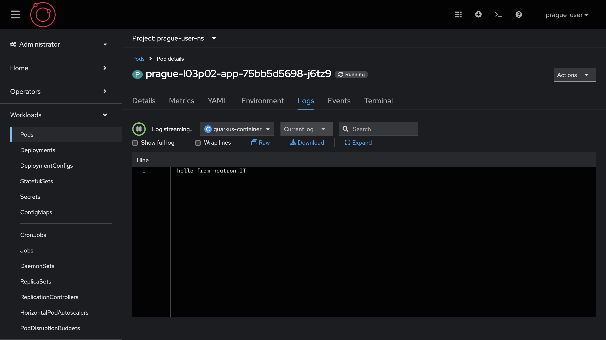

# Exercice Guidé : Examen des Ressources Kubernetes

Dans cet exercice, nous allons explorer comment examiner et manipuler les ressources Kubernetes en utilisant `oc`, l'outil de ligne de commande pour OpenShift. Nous allons nous concentrer sur les sorties personnalisées, l'extraction et la modification de manifestes YAML, et l'application de ces modifications.

## Objectifs de l'exercice

1. Utiliser un script pour afficher des informations spécifiques sur les pods.
2. Extraire un manifeste YAML d'un déploiement existant.
3. Modifier le nom du déploiement et supprimer les champs inutilisés.
4. Appliquer les modifications au cluster.

### Étape 1 : Affichage d'informations spécifiques sur les Pods

Utilisez la commande suivante pour afficher les noms et statuts des pods dans le cluster, en utilisant un format de sortie personnalisé.

```bash
oc get pods -o custom-columns=NAME:.metadata.name,STATUS:.status.phase
```

**Résultat attendu :**
```
NAME                STATUS
example-pod-1       Running
example-pod-2       Pending
example-pod-3       Running
```

### Étape 2 : Extraction d'un Manifeste YAML

Extrayez les informations d'un déploiement nommé `example-deployment` au format YAML.

```bash
oc get deployment l03p02-app -n l03p02 -oyaml > deployment.yaml
```

**Exemple d'output YAML dans `deployment.yaml` :**

```yaml
apiVersion: apps/v1
kind: Deployment
metadata:
  labels:
    app: l03p02-app
    app.kubernetes.io/instance: l03p02
  name: l03p02-app
  namespace: l03p02
spec:
  replicas: 1
  selector:
    matchLabels:
      app: l03p02-quarkus-aap
  template:
    metadata:
      creationTimestamp: null
      labels:
        app: l03p02-quarkus-aap
    spec:
      containers:
      - args:
        - -c
        - echo hello from neutron IT; while true; do sleep 10; done
        command:
        - /bin/bash
        image: registry.access.redhat.com/ubi8/ubi:latest
        name: quarkus-container
status:
  availableReplicas: 1
  conditions:
  - lastTransitionTime: "2024-07-22T15:46:57Z"
    lastUpdateTime: "2024-07-22T15:46:57Z"
    message: Deployment has minimum availability.
    reason: MinimumReplicasAvailable
    status: "True"
    type: Available
```

### Étape 3 : Modification du Manifeste YAML

Ouvrez le fichier `deployment.yaml` dans un votre terminal et apportez les modifications suivantes :


1. ```shell vi deployment.yaml ```
2. Enlevez toutes les metadata sauf "name" et "namespace"
2. Changez le nom du déploiement à `<YOUR-CITY>-l03p02-app`.
3. Changez le nom du namespace `<YOUR-CITY>-user-ns`.
4. Supprimez le champ `status` entier.

**Manifeste YAML modifié :**

```yaml
apiVersion: apps/v1
kind: Deployment
metadata:
  name: <YOUR-CITY>-l03p02-app # prague-l03p02-app
  namespace: <YOUR-CITY>-user-ns # prague-user-ns
spec:
  replicas: 1
  selector:
    matchLabels:
      app: l03p02-quarkus-aap
  template:
    metadata:
      creationTimestamp: null
      labels:
        app: l03p02-quarkus-aap
    spec:
      containers:
      - args:
        - -c
        - echo hello from neutron IT; while true; do sleep 10; done
        command:
        - /bin/bash
        image: registry.access.redhat.com/ubi8/ubi:latest
        name: quarkus-container
```

### Étape 4 : Application du Manifeste Modifié

Appliquez le fichier modifié au cluster en utilisant la commande suivante :

```bash
oc apply -f deployment.yaml
```


Cette commande créera un nouveau déploiement nommé `prague-l03p02-app` avec la configuration spécifiée.


### Conclusion

Dans cet exercice, nous avons appris à examiner les ressources Kubernetes en utilisant des formats de sortie personnalisés pour extraire des informations spécifiques. Nous avons également extrait un manifeste YAML, modifié ses champs, et appliqué ces modifications au cluster. Ces compétences sont essentielles pour gérer et interroger efficacement les ressources Kubernetes dans OpenShift.
