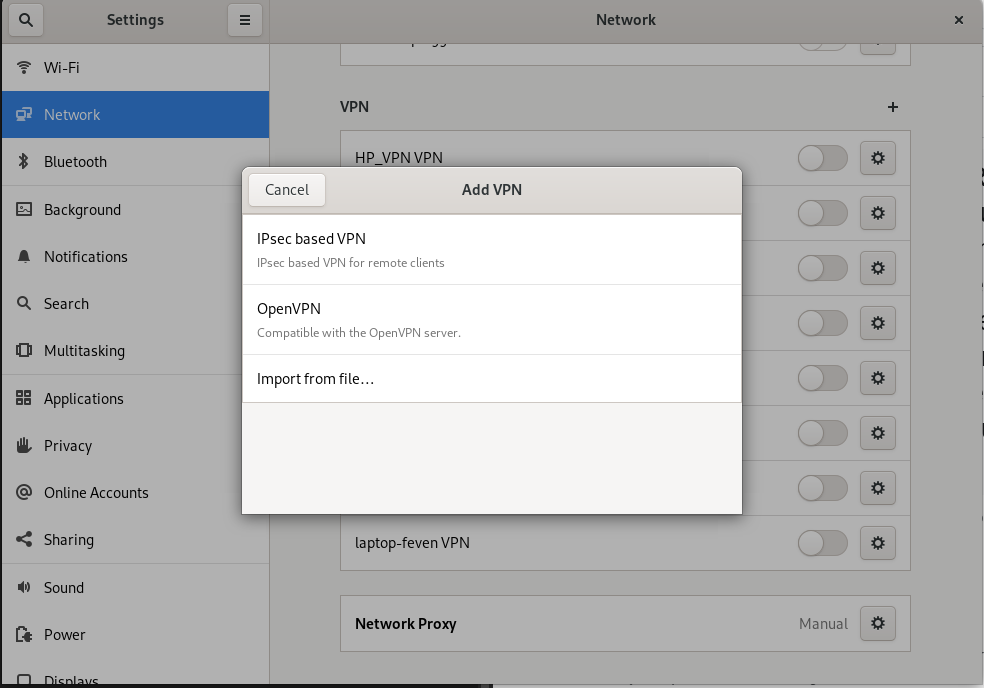

# Installation et configuration d'un VPN sur Scaleway

## Configuration de l'instance

Pour commencer, cliquez sur Compute > Instances > Create Instance.

Completez le formulaire avec les valeurs ci-dessous.

|Settings            | Value   |
| ------------------ | ------- |
| Availability Zone  | Paris 1 |
| Select an Instance | Dev1-S  |
| Choose an image    | Fedora  |

Ajoutez ensuite votre clé ssh et cliquez sur Créer une instance.

## Configuration d'openvpn

Connectez-vous à l'instance nouvellement créée.

Récupérez le script ci-dessous et rendez-le exécutable :

```shell
curl -O https://raw.githubusercontent.com/angristan/openvpn-install/master/openvpn-install.sh
chmod +x openvpn-install.sh
```

Puis éxecutez le

```shell
bash openvpn-install.sh
```

Répondez aux différentes questions du script et récupérer le fichier ```.ovpn```.

NOTE: Pour ajouter un client supplémentaire, exécutez à nouveau le même script et sélectionnez ``Add a new user```

```shell
bash openvpn-install.sh
```

## Configurer le client sur une machine rhel/fedora

Sur votre machine cliquez sur Settings et rendez-vous dans la partie Network. Cliquez sur le ```+``` puis sur ```Import from file``` et importer le fichier openvpn.



Cliquez sur ```Add``` .

Il vous suffit maintenant d'activer le toggle pour se connecter au VPN.


