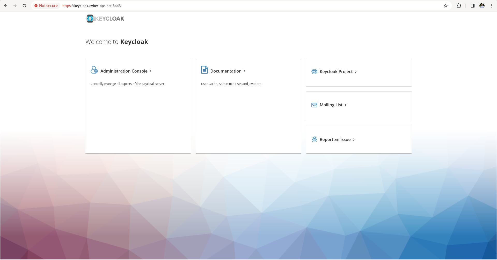

# Installation de keycloack sur Scaleway

## Configuration de l'instance

Pour commencer, cliquez sur Compute > Instances > Create Instance.

Completez le formulaire avec les valeurs ci-dessous.

|Settings            | Value   |
| ------------------ | ------- |
| Availability Zone  | Paris 1 |
| Select an Instance | Dev1-S  |
| Choose an image    | Fedora  |

Ajoutez ensuite votre clé ssh et cliquez sur Créer une instance.

## Installation de Keycloak

Connectez-vous à votre instance en utilisant ssh et suivez les instructions ci-dessous.

Clonez le repo keycloack container pour installer le repo en mode podman.

```shell
git clone git@github.com:feven-NIT/keycloak-container.git
```

Rendez vous dans le Container file de keycloak

```
vi  keycloak-container/keycloak/Containerfile
```

Remplacez les lignes conrespondant aux variables d'environnement ```KC_DB_URL``` et ```KC_HOSTNAME``` par l'addresse IP ou le hostname de votre machine.

Example :

```shell
FROM quay.io/keycloak/keycloak:latest as builder
#https://www.keycloak.org/server/containers

# Enable health and metrics support
ENV KC_HEALTH_ENABLED=true
ENV KC_METRICS_ENABLED=true

# Configure a database vendor
ENV KC_DB=postgres

WORKDIR /opt/keycloak
# for demonstration purposes only, please make sure to use proper certificates in production instead
RUN keytool -genkeypair -storepass password -storetype PKCS12 -keyalg RSA -keysize 2048 -dname "CN=server" -alias server -ext "SAN:c=DNS:localhost,IP:163.172.171.89" -keystore conf/server.keystore
RUN /opt/keycloak/bin/kc.sh build

FROM quay.io/keycloak/keycloak:latest
ARG DB_USER
ARG DB_PASSWORD
COPY --from=builder /opt/keycloak/ /opt/keycloak/

# change these values to point to a running postgres instance
ENV KC_DB_URL=keycloak.cyber-ops.net:5432 ##TOUPDATE
ENV KC_DB_USERNAME=$DB_USER
ENV KC_DB_PASSWORD=$DB_PASSWORD
ENV KC_HOSTNAME=keycloak.cyber-ops.net ##TOUPDATE
ENTRYPOINT ["/opt/keycloak/bin/kc.sh"]
```


Then you can deploy keycloak

```shell
mkdir $HOME/postgres-keycloak-data
./deploy.sh MY_DB_PASSWORD MY_KEYCLOAK_PASSWORD
```

## Validate

Go into your web browser.

Search ```https://keycloak.cyber-ops.net:8443```



Click on Administration Console.

In Username click on admin and put yout MY_KEYCLOAK_PASSWORD as password.


