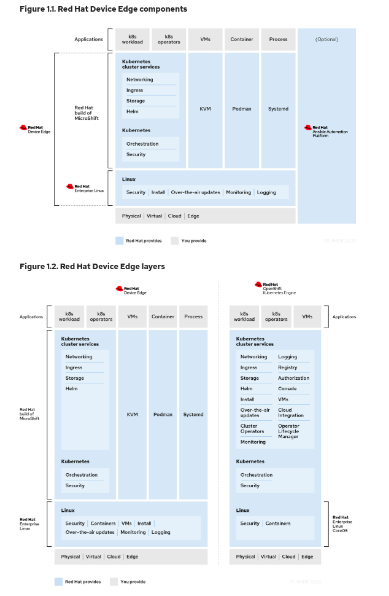

# Minilab

## Introduction

La gestion efficace des appareils à la périphérie (edge) des réseaux informatiques est devenue essentielle. Red Hat Device Edge émerge comme une solution polyvalente pour répondre aux défis spécifiques posés par la gestion des charges de travail sur des appareils à la limite du réseau. Cette plateforme offre une approche novatrice pour soutenir des tâches variées sur des dispositifs aux ressources limitées, rencontrant des contraintes de puissance, de refroidissement et de connectivité.

## Qu'est-ce que Red Hat Device Edge ?

Red Hat Device Edge est une plateforme flexible conçue pour répondre aux besoins des dispositifs à la périphérie, tels que les outils de ligne d'assemblage, les passerelles IoT, les points de vente et les contrôleurs industriels. Ces appareils opèrent souvent dans des environnements où les ressources informatiques sont limitées et où l'accès peut être restreint. Red Hat Device Edge offre une approche uniforme et adaptable pour prendre en charge diverses charges de travail sur ces appareils, malgré leurs contraintes en termes de ressources.

