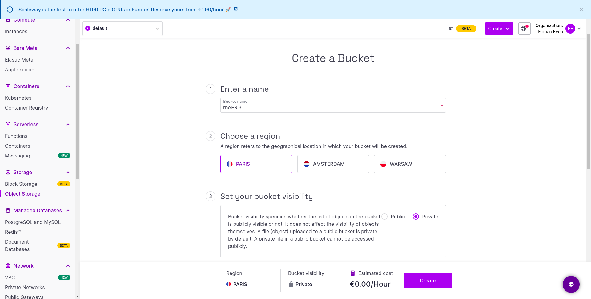
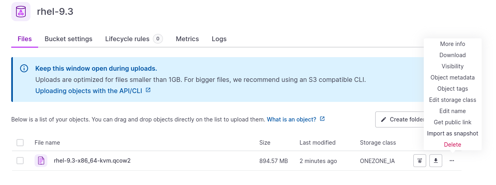
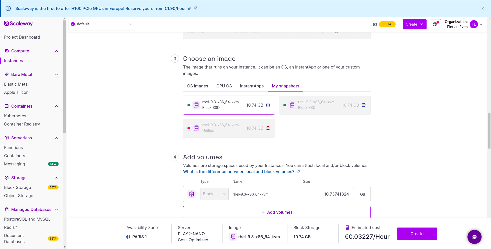

# Installation de Red Hat Enterprise Linux sur Scaleway

## Téléchargement de l'image qcow2

Pour commencer, téléchargez l'image qcow2 de Red Hat Enterprise Linux depuis le lien suivant : 
[RHEL qcow image](https://access.redhat.com/downloads/content/479/ver=/rhel---9/9.3/x86_64/product-software)


## Configuration de l'image

Une fois téléchargée, vous devez configurer l'image en changeant le mot de passe et en désactivant cloud-init à l'aide de la commande suivante :

```shell
virt-customize -a ~/Downloads/rhel-9.3-x86_64-kvm.qcow2 --root-password password:yourpassword --uninstall cloud-init
```

## Importation de l'image sur Scaleway

- Accédez à la section "Object Storage" sur Scaleway.
- Créez un bucket en spécifiant son nom et en choisissant la localisation (par exemple, Paris).

- Téléversez l'image rhel-9.3-x86_64-kvm.qcow2 dans ce bucket nouvellement créé.
- Cliquez sur les trois points (...) à côté du fichier et sélectionnez "Import as a snapshot". Choisissez le type "Block SSD" et importez le fichier en tant que snapshot.

- Accédez à la section "Instances" sur Scaleway.
- Cliquez sur "Create instance".
- Une instance PLAY2_NANO suffit pour microshift. Dans la section "Choose image", accédez à "My snapshot" et sélectionnez le snapshot que vous venez d'importer.

- Configurez les détails de votre instance et procédez à sa création.
 
Une fois l'instance créée, vous pourrez vous connecter depuis la console scaleway en utilisant les identifiants par défaut : root/yourpassword. 

Créez un nouvel utilisateur. 

```shell
sudo useradd feven
```

```shell
sudo passwd feven
```

```shell
sudo usermod -aG wheel feven
```

Validez la connexion en vous connectant à la machine via ssh

```shell
ssh feven@YourIP
```

Pour terminer, inscrivez-vous pour votre abonnement Red Hat

```shell
subscription-manager register
```


