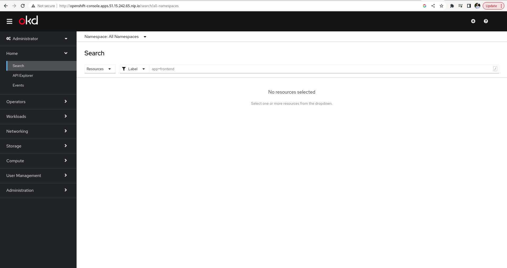

# Connexion a la console 

## Deployer la console


Nous allons déployer la console OKD dans notre environnement. Pour contourner la nécessité d'avoir un DNS configuré, nous allons utiliser nip.io.  

NOTE: Avant de déployer le manifeste ci-dessous, modifiez l'adresse IP pour fournir celle de votre machine microshift.

```shell
cat <<EOF > deploy_console.yaml
---
apiVersion: v1
kind: Namespace
metadata:
  name: ocp-console
---
apiVersion: v1
kind: ServiceAccount
metadata:
  name: openshift-console
  namespace: ocp-console
secrets:
- name: openshift-console-token
---
apiVersion: v1
kind: Secret
metadata:
  name: openshift-console-secret
  namespace: ocp-console
  annotations:
    kubernetes.io/service-account.name: openshift-console
type: kubernetes.io/service-account-token
---
apiVersion: rbac.authorization.k8s.io/v1
kind: ClusterRoleBinding
metadata:
  name: openshift-console-cluster-role-binding
  namespace: ocp-console
roleRef:
  apiGroup: rbac.authorization.k8s.io
  kind: ClusterRole
  name: cluster-admin
subjects:
- kind: ServiceAccount
  name: openshift-console
  namespace: ocp-console
---
apiVersion: apps/v1
kind: Deployment
metadata:
  name: openshift-console-deployment
  namespace: ocp-console
  labels:
    app: openshift-console
spec:
  replicas: 1
  selector:
    matchLabels:
      app: openshift-console
  template:
    metadata:
      labels:
        app: openshift-console
    spec:
      containers:
      - name: openshift-console-app
        image: quay.io/openshift/origin-console:4.8.0
        env:
        - name: BRIDGE_USER_AUTH
          value: disabled
        - name: BRIDGE_K8S_MODE
          value: off-cluster
        - name: BRIDGE_K8S_MODE_OFF_CLUSTER_ENDPOINT
          value: https://api.51.15.55.253.nip.io:6443
        - name: BRIDGE_K8S_MODE_OFF_CLUSTER_SKIP_VERIFY_TLS
          value: "true"
        - name: BRIDGE_K8S_AUTH
          value: bearer-token
        - name: BRIDGE_K8S_AUTH_BEARER_TOKEN
          valueFrom:
            secretKeyRef:
              name: openshift-console-secret
              key: token
---
apiVersion: v1
kind: Service
metadata:
  name: openshift-console-service
  namespace: ocp-console
spec:
  selector:
    app: openshift-console
  ports:
  - port: 80
    targetPort: 9000
---
kind: Route
apiVersion: route.openshift.io/v1
metadata:
  name: openshift-console
  namespace: ocp-console
spec:
  host: openshift-console.apps.51.15.55.253.nip.io
  to:
    kind: Service
    name: openshift-console-service
    weight: 100
  port:
    targetPort: 9000
  wildcardPolicy: None
EOF
```

```shell
oc apply -f deploy_console.yaml
```


## Vérification

Vous pouvez maintenant accéder à la console OKD microshift 





