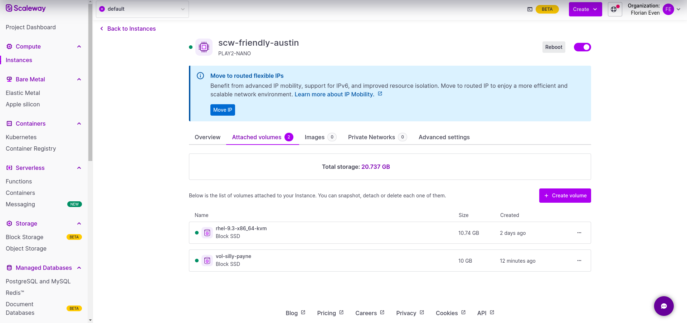

# Configure dynamic storage


MicroShift permet un provisionnement de stockage dynamique et prêt à l'emploi avec LVMS. Le plugin LVMS est la version Red Hat de TopoLVM, un plugin CSI permettant de gérer les volumes LVM pour Kubernetes.

## Ajouter du stockage

Dans un premier temps ajoutez un disque de stockage dans scaleway. Pour cela cliquez sur votre instance microshift puis sur Attached volumes et enfin sur Create volume. Selectionnez une taille (en GB) et cliquez sur Add Volume.




vous devrez ensuite identifier les disques que vous souhaitez utiliser pour le VG. 

```shell
sudo pvcreate /dev/sdb
```

Une fois le volume physique préparé, vous pouvez créer un groupe de volumes nommé « microshift » et y ajouter le(s) volume(s) physique(s) initialisé(s) :


```shell
sudo vgcreate microshift /dev/sdb
```

Redemarrez ensuite microshift 

```shell
systemctl restart microshift
```

## Vérification

Vous devriez maintenant avoir un nouveau namespace "openshift-storage" dans la console. Avec un pod topolvm-controller et un pod topolvm-node Running.


You can now test by deploying an nginx basic application.

```shell
oc create ns demo
```
```shell
kubectl config set-context --current --namespace=demo
```

```shell
cat <<EOF | oc apply -f -
kind: PersistentVolumeClaim
apiVersion: v1
metadata:
  name: my-lv-pvc
spec:
  accessModes:
  - ReadWriteOnce
  resources:
    requests:
      storage: 1G
---
apiVersion: v1
kind: Pod
metadata:
  name: my-pod
spec:
  containers:
  - name: nginx
    image: nginx
    command: ["/usr/bin/sh", "-c"]
    args: ["sleep 1h"]
    volumeMounts:
    - mountPath: /mnt
      name: my-volume
    securityContext:
      allowPrivilegeEscalation: false
      capabilities:
        drop:
          - ALL
      runAsNonRoot: true
      seccompProfile:
        type: RuntimeDefault
  volumes:
    - name: my-volume
      persistentVolumeClaim:
        claimName: my-lv-pvc
EOF
```
